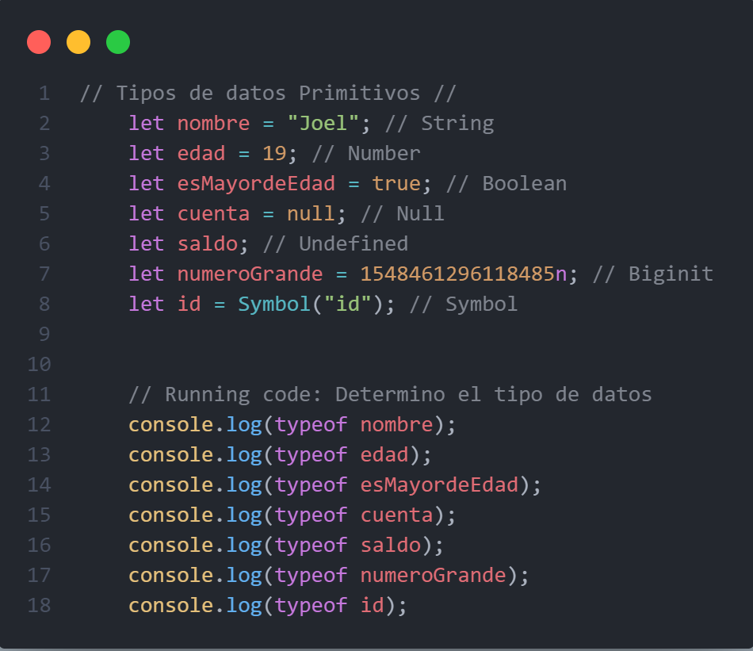
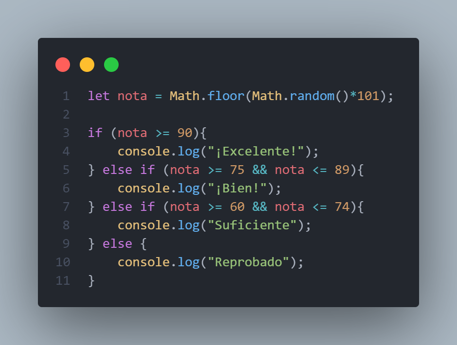
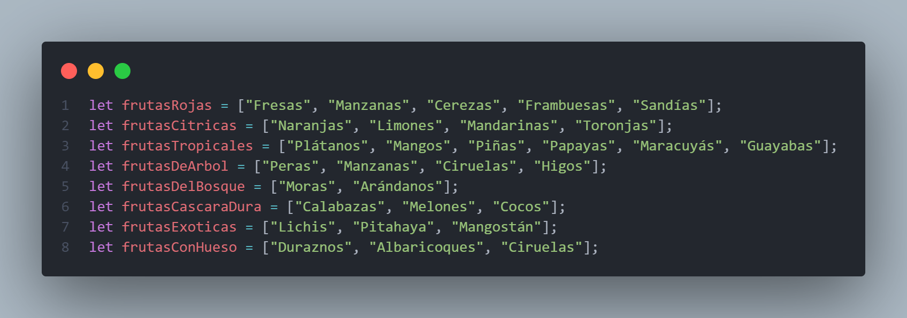
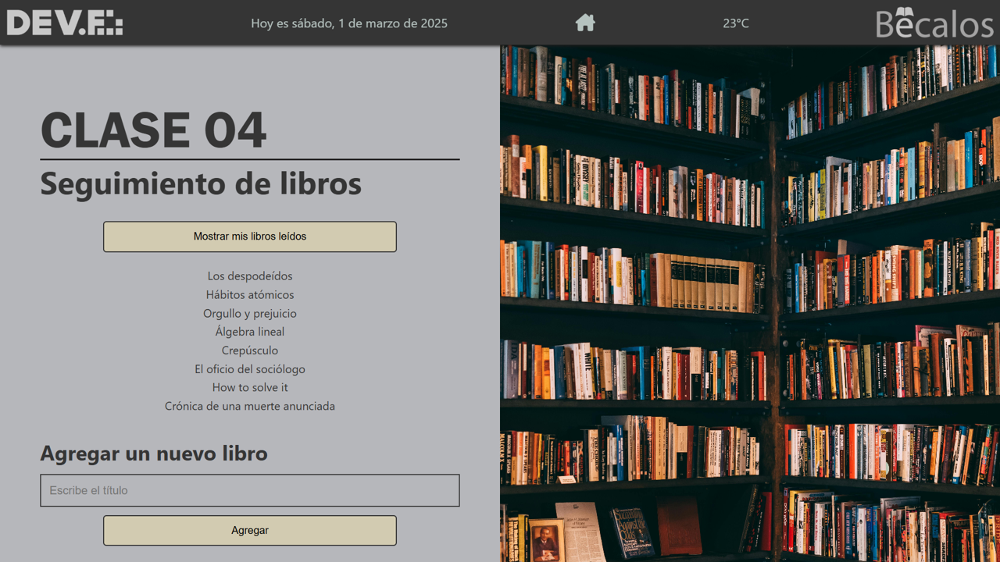

# ¡Welcome back to my JavaScript Repository!

Este repositorio ha sido iniciado en febrero de 2025 como un espacio para compartir evidencias del trabajo de clase correspondiente a la Tercera Unidad del Curso de FrontEnd impartido por DEV.F. En esta extensión estaremos aprendiendo sobre JavaScript, un lenguaje de programación que complementa a HTML y CSS para darle vida a nuestro sitio web.

## Funcionamiento del sitio
Dentro de este repositorio podrá encontrar, en cada una de las carpetas, las prácticas realizadas como proyectos durante cada lección. 
Al explorar cada uno de los archivos se percatará que todo está claramente comentado para su entendimiento.
Proximamente, me daré a la tarea de hacer la respectiva página de presentación para el módulo para un atractivo más visual.

## Contenido
A continuación, se compilará una reseña del trabajo llevado a cabo en cada una de las clases del curso. Esta sección se actualizará periódicamente hasta la culminación del módulo 03.

### Clase 01: Fundamentos de JavaScript
Se revisaron temas escenciales para el entendimiento de JavaScript como lenguaje de programación, tales como paradigmas de programación, aplicaciones de JavaSript, beneficios y principalmente **Tipos de Datos**.
La práctica de la lección gira en torno a este último tema mencionado, donde utilizamos el lenguaje de programación interpretado y de alto nivel para hacer declaraciones de variables con datos de diversos tipos dentro de las dos categorías *Primitivos* y *Compuestos*.

### Clase 02: Comparaciones y decisiones en JavaScript
En esta sesión estudiamos en detalle los distintos tipos de variables, comprendiendo cómo se utilizan para almacenar diferentes tipos de datos, constantes o propensos al cambio. También exploramos el concepto de concatenación, que nos permite combinar textos o datos de manera flexible para crear mensajes dinámicos. Además, analizamos los operadores básicos, de asignación y lógicos que son fundamentales para realizar cálculos, comparar valores y establecer relaciones entre datos. Otro tema clave fue el uso de estructuras condicionales, que permiten tomar decisiones dentro de un programa en función de ciertas condiciones, como evaluar si un número cumple un criterio específico. 

Gracias a estos conocimientos, ahora somos capaces de desarrollar programas básicos capaces de automatizar tareas sencillas. Por ejemplo, la práctica de la clase donde hemos creado una aplicación que analiza la calificación obtenida por el usuario (generada automáticamente) y, en función del resultado, envíe un mensaje personalizado al alumno indicando su estatus del curso.

### Clase 03: Arreglos y Ciclos en JavaScript
En esta práctica se exploró el uso de arreglos y ciclos en JavaScript, dos herramientas fundamentales para la manipulación de datos y la automatización de procesos. A través del desarrollo de un programa para la administración de una frutería, se aplicaron estos conceptos para organizar, contar y gestionar el inventario de frutas de forma eficiente.

Se emplearon arreglos para almacenar las diferentes categorías de frutas, permitiendo agruparlas y acceder a ellas de manera ordenada. Además, se utilizaron ciclos como *for* y *while* para recorrer estos arreglos y contar las frutas disponibles. Para la realización de esta práctica tuve que investigar un poco más porque tal cual nos habían enseñado no vi clara la forma de hacerlo.

Agrego en este repositorio la carpeta de la clase con las notas tomadas, algunos ejercicios puestos por el sensei y otros tomados de las lecciones en Campus.

### Clase 04: Funciones
Para esta clase exploramos la amplia gama de funciones que podemos utilizar en nuestros sitios para dinamizarlos. He creado una aplicación sencilla en JavaScript que permite gestionar una lista de libros leídos. Su objetivo es mostrar los libros almacenados y permitir al usuario agregar nuevos títulos dinámicamente.
Se hizo uso de un array para almacenar los libros y todo lo hemos ligado a una página web para mayor visibilidad.

## Utiliza este repositorio
[Enlace del proyecto en GitHub Pages](https://mrinvaderlop.github.io/Modulo03-JS/)

[Clona este repositorio aquí](https://github.com/MrInvaderLop/Modulo03-JS)

## Información del autor:
El desarrollador de este proyecto es Joel López&reg;
